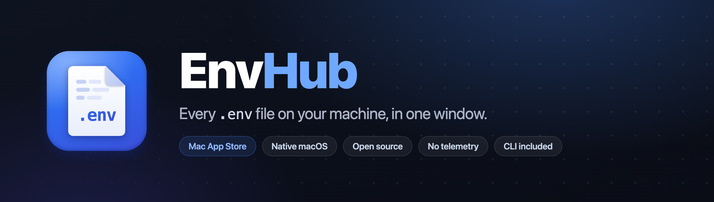
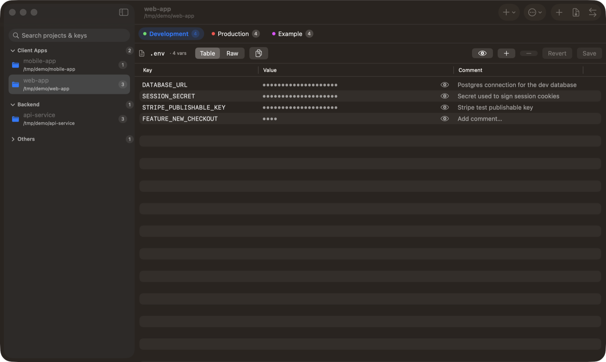
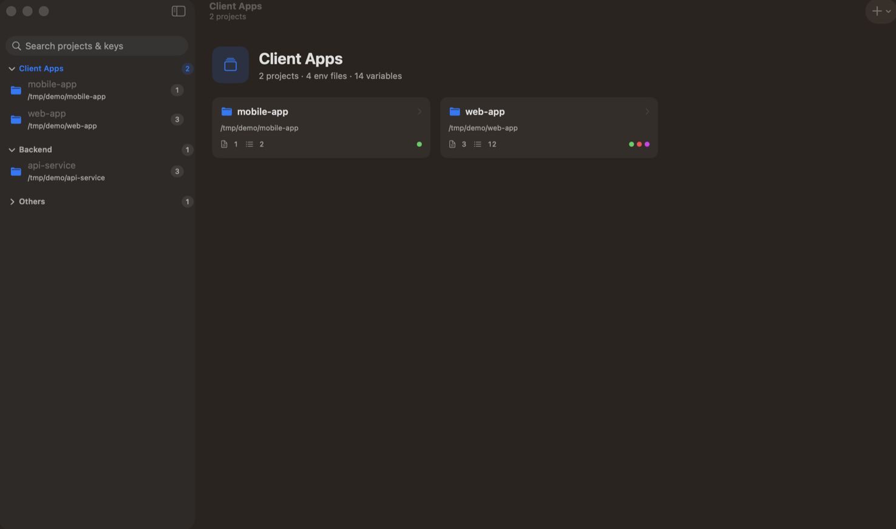
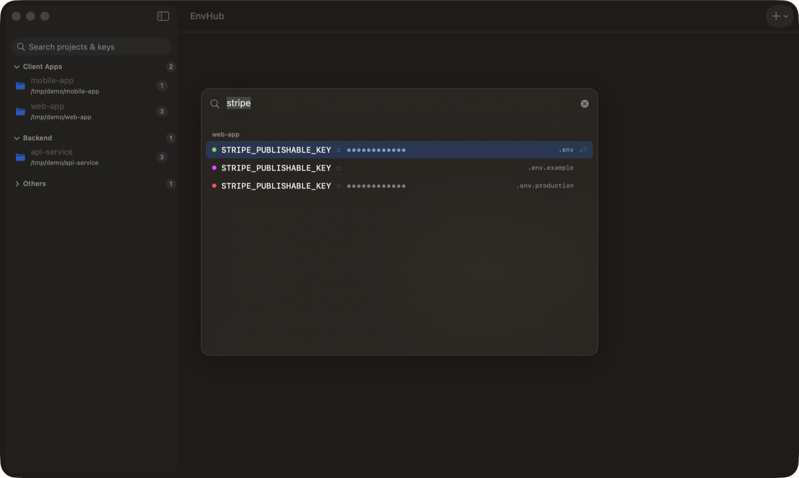
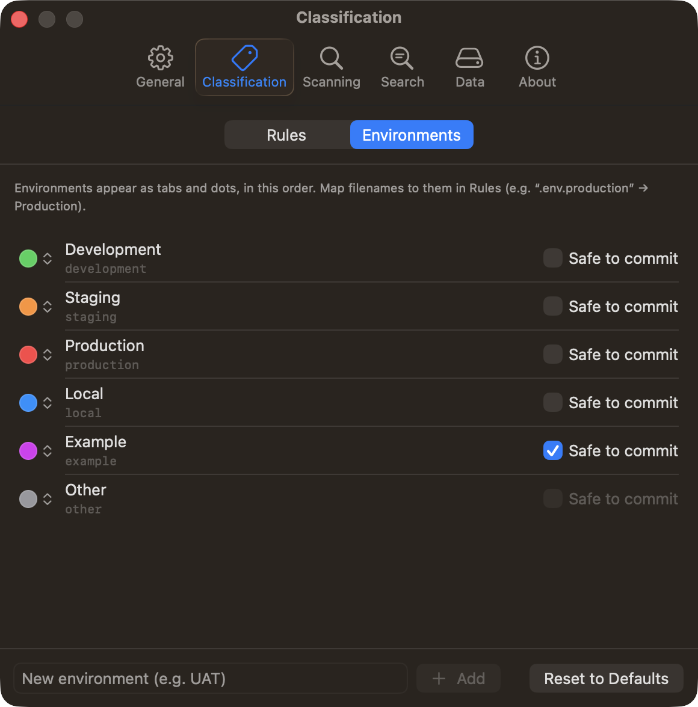
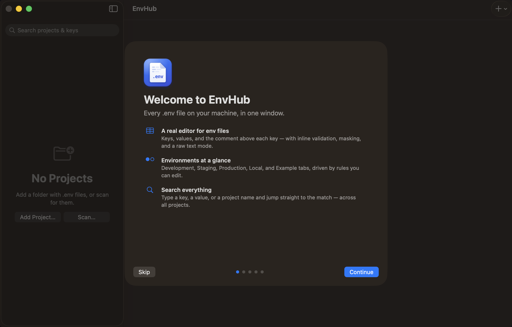
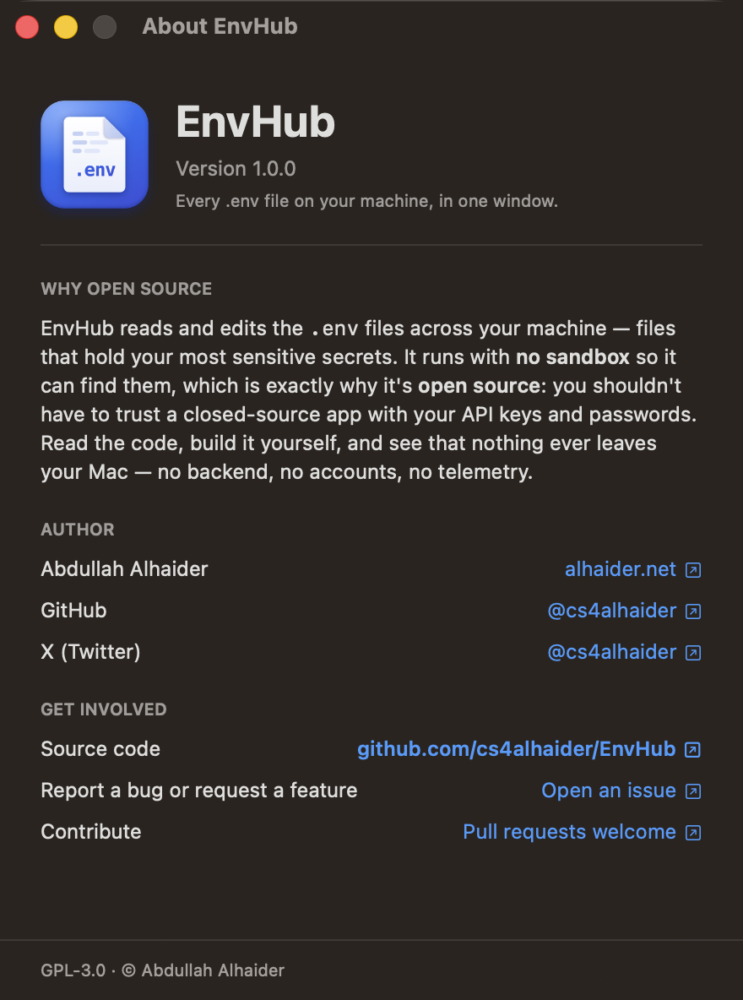

<p align="center">
  
</p>

<p align="center">
  <a href="#requirements--editions"></a>
  <a href="#architecture"></a>
  
  <a href="LICENSE"></a>
  
</p>

<p align="center">
  A native <b>macOS</b> app — plus a companion CLI — that puts every <code>.env</code> file on your
  machine in one window.<br>
  Structured editing, workspaces, cross-project search, custom environments, and
  password-encrypted sharing.<br>
  <b>Open source, local-only, no accounts, no telemetry.</b>
</p>

<p align="center">
  <a href="https://apps.apple.com/app/id6788664509">
    
  </a>
  <br>
  <sub>Currently in App Review — releasing soon. The <a href="#install">Homebrew CLI</a> is available today.</sub>
</p>

---

<p align="center">
  
</p>

## Why EnvHub?

Your `.env` files are scattered across dozens of projects, hold your most sensitive
secrets, and are one careless `git add` away from a leak. EnvHub gathers them into a
single, native window: a real editor instead of a text file, environments at a glance,
and search across every project.

And because it reads secrets across your machine, it's **open source on purpose** —
you can read exactly what it does, build it yourself, and verify that nothing ever leaves
your Mac.

## Features

- **📁 Projects & workspaces** — every folder with `.env*` files, grouped into **Pinned**,
  your own **workspaces**, and **Others**. Collapsible sections (remembered across
  launches), drag-and-drop between them, multi-select to move or remove in bulk, and a
  per-workspace **dashboard**. Single-click to open, **double-click for a separate window**,
  ⌘-double-click for a **native tab**.
- **✏️ A real editor** — a Key / Value / **Comment** table with inline editing, plus a raw
  "developer" text view. The Comment column is bound to the `# comment` line above each
  key. Values are **masked** by default (safe to screen-share); reveal per-row or all at
  once.
- **🧾 Save review** — ⌘S shows a clear diff (**added / changed / removed**, values *and*
  comments) before anything touches disk, and every save keeps a `.bak` backup next to
  the file.
- **🏷️ Custom environments** — Development / Staging / Production / Local / Example ship by
  default, but you can **add your own** (UAT, pre-prod, …), rename them, set a **color**,
  and mark which are safe to commit. Files map to them via your own **editable regex rules**.
- **🔎 Search everything** — type `gemini` and see every project whose keys, values,
  filenames, or names match, grouped by project. Or hit **⇧⌘O** for an Xcode-style
  **Quick Open** popup and jump straight to a project. Per-environment toggles can keep
  production values out of results entirely.
- **🔐 Encrypted sharing** — export a file, a project, or your **whole library** as a
  password-protected `.envenc` (**AES-256-GCM** + **scrypt**). Import recreates the files
  wherever you choose. Wrong passwords fail cleanly.
- **⚡ Fast, safe scanner** — discover `.env` files across chosen folders. The walk is
  **parallel**, skips caches (`~/Library`, `node_modules`, …), can **stop early to review**,
  and never re-imports what you already have.
- **🧯 Faithful save** — untouched lines are written back **byte-for-byte**: comments,
  blank lines, ordering, even CRLF endings survive every save.
- **↔️ Diff** — read-only, side-by-side comparison of two environments, so the key that's
  missing in Production never surprises you again.
- **🛡️ Git-leak guard** *(Homebrew edition)* — when a `.env` file is tracked by git, EnvHub
  warns you and can **unstage + gitignore** it in one click. Example/template files are
  exempt.
- **⌨️ CLI** — `scan`, `list`, `get`, `export`, `import`, `workspace`, `add`, `open`, and
  `store` on the exact same core, sharing the same data as the app. `envhub add .` adds a
  folder as a project; `envhub .` opens it in a window without adding it.

## Screenshots

<table>
  <tr>
    <td width="50%" align="center">
      <br>
      <sub><b>Workspace dashboard</b> — click a section header for an overview of its projects.</sub>
    </td>
    <td width="50%" align="center">
      <br>
      <sub><b>Quick Open (⇧⌘O)</b> — search keys, values, and files across every project.</sub>
    </td>
  </tr>
  <tr>
    <td width="50%" align="center">
      <br>
      <sub><b>Custom environments</b> — name, color, and safe-to-commit, per environment.</sub>
    </td>
    <td width="50%" align="center">
      <br>
      <sub><b>Welcome</b> — a quick tour on first launch.</sub>
    </td>
  </tr>
</table>

## Use cases

- **"Where did I put that key?"** — ⇧⌘O, type `stripe`, jump to the project that has it.
- **Audit a secret across projects** — search a key name and see every project, environment,
  and file it appears in.
- **Onboard a teammate** — make a committed `.env.example` from a real file (keys, no
  values), or send them an encrypted `.envenc` and share the password out-of-band.
- **Move a machine** — `export` your whole library to one `.envenc`, restore it on the new
  Mac with `import`.
- **Organize a monorepo** — group frontend/backend/infra projects into workspaces; open
  each in its own tab or window.
- **Script it** — `envhub .` to open the current folder in the app, `envhub get KEY --mask`
  in a shell, `envhub store` to back up the database.

## Requirements & editions

Requires **macOS 26 (Tahoe)**. EnvHub ships as two editions built from the same code:

| | **Mac App Store** | **Homebrew / direct** |
| --- | --- | --- |
| Runs in the App Sandbox | ✓ — you grant folders via the standard open panel, remembered across launches | — unsandboxed, so it can scan anywhere on disk |
| Everything above (editor, workspaces, search, environments, scanner, encrypted sharing, diff) | ✓ | ✓ |
| Git-leak guard + one-click `.gitignore` | — | ✓ |
| Bundled `envhub` CLI + in-app installer | — (install the CLI via Homebrew alongside) | ✓ |

Both editions read and write the **same shared library**, so mixing them — or the app with
the Homebrew CLI — just works. In the unsandboxed edition, macOS may ask before scanning
Desktop / Documents / Downloads: that's macOS asking, not EnvHub phoning home.

## Install

### Mac App Store (recommended)

<a href="https://apps.apple.com/app/id6788664509">
  
</a>

*Currently in App Review — the badge goes live the moment Apple flips the switch.*

### Homebrew

```sh
# The CLI — available today
brew install cs4alhaider/tap/envhub

# The app (unsandboxed edition, bundles the CLI) — coming with the next notarized build
brew install --cask cs4alhaider/tap/envhub-app
```

Prefer building it yourself? Everything you need is in
[CONTRIBUTING.md](CONTRIBUTING.md) — the whole project builds with Xcode 26 and
`swift build`.

## CLI reference

```sh
# Add the current folder to EnvHub (it appears in the sidebar)
envhub add .
envhub add ~/code/my-app

# Open a folder in a project window WITHOUT adding it (a quick look)
envhub .
envhub ~/code/my-app

# Discover .env files, grouped by folder (‑‑deep to recurse)
envhub scan ~/Developer --deep

# List a project's files and variables (‑‑mask to hide values, ‑‑keys-only for keys)
envhub list ./my-app --mask

# Print one key's value (from a file, or searching a project folder)
envhub get DATABASE_URL --file ./my-app/.env
envhub get API_KEY --project ./my-app --mask

# Encrypt to .envenc (‑‑project for the whole folder; password prompted or from a file)
envhub export ./my-app/.env --out secrets.envenc
envhub export ./my-app --project --password-file ./pw.txt

# Decrypt a .envenc into a folder (‑‑force to overwrite)
envhub import secrets.envenc --into ./restored --force

# Workspaces — the same sidebar sections the app shows (shared store)
envhub workspace list
envhub workspace create Backend
envhub workspace move ./my-app Backend
envhub workspace sort Backend --by name

# Back up or inspect the shared data store
envhub store
cp "$(envhub store)" ~/envhub-backup.store
```

The app and CLI share one store in the `group.net.alhaider.EnvHub` app-group container
(`envhub store` prints the exact path); set `ENVHUB_STORE=<path>` to point either at a
different one.

### For AI agents

[`skills/envhub-cli/`](skills/envhub-cli/SKILL.md) is a ready-made agent skill that teaches
coding agents to use the CLI safely (masking rules, password handling, workspace
semantics). Drop the folder into your agent's skills directory — e.g.
`.claude/skills/envhub-cli/` for Claude Code.

## Architecture

One SwiftPM package (`EnvHubKit/`) holds **all** UI-free logic and the tests. A thin
SwiftUI app links it via a local package reference and consumes the `Core` and `Helper`
products; the `envhub` CLI is its own small package at `EnvHubCLI/`, built on `Core`.

```
EnvHubKit/                    the Swift package — libraries + tests
  Package.swift
  Sources/
    Model/      pure Sendable value types (EnvDocument, EnvKind + catalog, diff, …)
    Parser/     .env read/write — comment-preserving, byte-stable          → Model
    Scanner/    parallel, cancellable filesystem discovery                 → Model
    Classifier/ ordered regex rules → environment                          → Model
    Crypto/     AES-256-GCM + in-house scrypt (RFC 7914), .envenc          → Model
    Core/       facade + services + shared SwiftData store (app & CLI)
    Helper/     SwiftUI @Environment injection of Core services            → Core
  Tests/        Swift Testing suites per module (UI-free)
EnvHub/         SwiftUI macOS app (links Core + Helper)
EnvHubCLI/      envhub CLI package — one file per subcommand               → Core
```

**Design principles**

- **All business logic lives in the package** — the app target is views + view-models only.
  Concern modules depend only on `Model`; `Core` is the single facade; `Helper` is the only
  package target that imports SwiftUI, so the CLI never links a UI framework.
- **Swift 6 strict concurrency.** Work that must leave the caller's actor — filesystem
  walks, scrypt, bulk parsing — is explicitly `@concurrent`, so views simply `await` and
  stay responsive.
- **Your `.env` files are the source of truth.** SwiftData stores only app state (projects,
  workspaces, rules, preferences) in one shared store the app and CLI both open.
- **Crypto is dependency-free and auditable** — scrypt is implemented in-house on CryptoKit
  primitives and validated against the official RFC 7914 vectors.

## How saving works

A **Save** writes `<file>.bak` (a copy of the current on-disk file) *before* overwriting the
real file. Edits are reconciled onto the original document so comments, blank lines, and
untouched entries are written back byte-for-byte; only changed/added/removed lines are
rewritten.

## The `.envenc` format

A `.envenc` file is a JSON envelope:

```json
{
  "version": 1,
  "type": "single | project | library",
  "kdf": "scrypt",
  "kdfParams": { "N": 32768, "r": 8, "p": 1 },
  "salt": "base64",
  "nonce": "base64",
  "ciphertext": "base64"
}
```

The plaintext payload (before encryption) is JSON describing the file(s) — each with its
key/value pairs and raw text for faithful materialization. The key is
`scrypt(password, salt)`; the payload is sealed with AES-256-GCM, with the 16-byte GCM auth
tag appended to the ciphertext.

## Security notes

- No network access, no telemetry, no accounts. Nothing leaves your machine —
  see the [privacy policy](PRIVACY.md).
- Working `.env` files are stored as-is — encryption applies only to explicit `.envenc`
  export.
- Lost `.envenc` passwords are unrecoverable by design.

## Keyboard shortcuts

| Action | Shortcut |
| --- | --- |
| Add project | ⌘N |
| New workspace | ⇧⌘N |
| Search across projects (Quick Open) | ⇧⌘O |
| Scan for `.env` files | ⇧⌘F |
| Import `.envenc` | ⌘I |
| Save file (opens Save Review) | ⌘S |
| Settings | ⌘, |

## Contributing

Issues and pull requests are genuinely welcome — bugs, ideas, or an environment type EnvHub
doesn't have yet. See [CONTRIBUTING.md](CONTRIBUTING.md); the short version: business logic
goes in the Swift package with tests, the app stays a thin SwiftUI layer, and
`swift test --package-path EnvHubKit` + `xcodebuild` must pass.

## Author



Built by **Abdullah Alhaider** —
[alhaider.net](https://alhaider.net) ·
[GitHub @cs4alhaider](https://github.com/cs4alhaider) ·
[X @cs4alhaider](https://x.com/cs4alhaider)

EnvHub is free and open source because it handles your secrets — you should be able to
read exactly what it does. If it's useful to you, a ⭐ on GitHub is appreciated, and
issues or pull requests even more so.

## License

[GPL-3.0](LICENSE) © Abdullah Alhaider. Official binaries distributed through the
Mac App Store are additionally offered under Apple's standard EULA.
